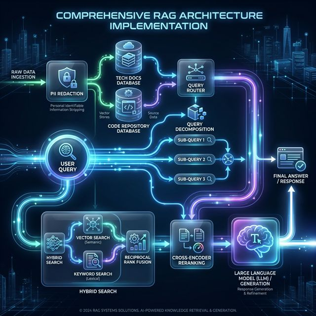

# RAG Implementation Patterns

This document provides an architect-level examination of how specific architectural patterns are implemented within the project's backend codebase.

## 1. Hybrid Retrieval and Reranking Patterns

### Hybrid Search

- **Location:** `src/features/chat/application/chat_service.py` via the `_hybrid_search` method.
- **Implementation:** It executes two parallel asynchronous tasks for every query: a semantic vector search (`vector_store.search`) and an exact keyword search (`vector_store.search_keyword`) against the LanceDB database.
- **Reciprocal Rank Fusion (RRF):** The results are combined using the `_rrf_fusion` method. It iterates through both result lists and assigns a fused score using the formula `1.0 / (k + rank + 1)` (where `k=60`). This mathematical approach ensures chunks appearing high in both vector and keyword searches bubble up to the top without needing to normalize different scoring scales.

#### What is a Semantic Vector Search? (Simple Explanation)

Imagine you have a giant database of documents and you type in a search for: _"devices for cleaning the floor"_.

A traditional keyword search looks for exactly those strict words. If it sees a document that says _"This is a great vacuum cleaner,"_ it might ignore it entirely, because the words "devices", "cleaning", and "floor" don't appear in that exact sentence. It only matches letters to letters.

Semantic Vector Search solves this by focusing on **meaning** (semantics) rather than strict word matching:

1. **Turning Words into "Coordinates" (Embeddings):** When a document is uploaded, an AI converts the _core concepts_ of that paragraph into a long list of numbers (usually 300 to 1,500 numbers long) called a **vector embedding**. You can think of these numbers as coordinates on a giant 3D map. Because a "vacuum" and "cleaning the floor" have very similar meanings, the AI places their coordinates right next to each other on this map.
2. **The Search Process:** When a user types their question, the system turns it into its own set of coordinates on the exact same map. The database (LanceDB) then simply looks at the map and says, _"Show me all the paragraphs that are physically closest to these new coordinates."_

Because "vacuum cleaner" lives in the exact same mathematical neighborhood on the map as "devices for cleaning the floor", it retrieves the vacuum cleaner paragraph—even if they share exactly zero matching words.

### Reranking

- **Location:** `src/features/rag/application/reranking_service.py`.
- **Implementation:** If enabled, the top results from the hybrid search are passed to a Cross-Encoder model (`cross-encoder/ms-marco-MiniLM-L-6-v2` via `sentence_transformers`). The model scores pairs of `(query, document_text)` to determine highly precise semantic relevance, re-sorting the chunks before they are injected into the final LLM prompt context.

#### What is Reranking? (Simple Explanation)

Imagine you're at a library looking for books on "how to bake an apple pie."

1. **The "Fast Search" (Hybrid Search):** First, you use the library computer. The computer is super fast. It grabs 50 books that mention "apples", "baking", or have recipes. But because it has to search through millions of books instantly, it can't read the actual paragraphs closely. It just throws the top 50 matches into a pile for you. This pile will have some great books, but also maybe a few irrelevant ones (like a fiction book about a magical apple).
2. **The "Slow, Careful Judge" (Reranking with a Cross-Encoder):** Now, you don't want to read all 50 books. So you hire an expert librarian (the Cross-Encoder). The librarian takes your exact question ("how do I bake an apple pie") and reads the first page of every single book in that pile of 50. They score each book out of 10 based on how perfectly it answers your specific question. Because the librarian is reading the question and the book text side-by-side (that's what a "score pairs" means), they are incredibly accurate at spotting the difference between "an apple pie recipe" and "a story about an apple pie."
3. **The Result:** The librarian hands you back the top 5 absolute best books, ordered from best to worst. We then hand only those top 5 perfect books to the final AI (like ChatGPT or Llama) so it can write out the perfect recipe for you without getting distracted by the irrelevant books.

**Why do we do this in two steps?** Because the librarian (Cross-Encoder) is slow and expensive. If we asked the librarian to read every book in the whole library, it would take years. So we use the fast computer first to narrow it down to 50, and then use the smart, careful librarian to arrange those 50 perfectly.

**In Code Terms:** In `reranking_service.py`, we take the initial decent-but-messy list of chunks from the database, feed them one-by-one alongside the user's query into a specialized AI model (`ms-marco-MiniLM-L-6-v2`), and use its very accurate scores to sort the list so only the cream of the crop goes to the final LLM prompt.

## 2. Multi-Index and Multi-Hop RAG

### Routing Queries (Multi-Index)

- **Location:** `src/features/rag/application/router_service.py`.
- **Implementation:** The `QueryRouter` uses an initial LLM call to classify the user's intent to determine which LanceDB table to search. It prompts the LLM with available choices (`technical_docs`, `codebase`, `incident_reports`, `general`) and parses the required JSON response for an `index_name` and a `confidence` level. This index target defaults to `technical_docs` if routing fails.

#### What is Query Routing? (Simple Explanation)

Imagine walking into a massive hospital building. If you have a broken arm, you shouldn't wander through the cafeteria—you go straight to the emergency room.

Our `QueryRouter` is the receptionist at the front door. When a user asks a question, the router quickly figures out if they are looking for technical manuals, source code, or bug reports. Instead of randomly searching the entire company's database (which takes too long and mixes up results), it sends the question _only_ to the specific file cabinet meant for that topic.

### Multi-Hop Reasoning

- **Location:** `src/features/rag/application/query_decomposition_service.py`.
- **Implementation:** The `QueryDecompositionService` takes complex comparative questions and asks the configured model (e.g., Llama 3 70B) to break them down into 2-3 simpler, self-contained sub-queries (e.g., "Compare X to Y" becomes "What is X?" and "What is Y?"). In `chat_service.py`, embeddings are generated for _all_ sub-queries, and parallel searches are dispatched for each. All retrieved chunks are merged, deduplicated by chunk ID (keeping the highest score), flagged with a `"multi-hop"` metadata tag, and passed collectively as context.

#### What is Multi-Hop Reasoning? (Simple Explanation)

Imagine asking a friend, _"Which is further away: the Eiffel Tower or the Grand Canyon?"_ Your friend can't look up a single book that has that exact comparison. Instead, they have to do "hops":

1. Look up the distance to the Eiffel Tower.
2. Look up the distance to the Grand Canyon.
3. Compare the two numbers to give you an answer.

When a user asks our system a complex matching question, a regular search would get confused. Our `QueryDecompositionService` intercepts these hard questions and splits them into smaller, distinct searches. It gathers all the separate pieces of evidence and hands the complete puzzle to the final AI to solve.

### Composing & Source Citing

- **Location:** `chat_service.py` (`_assemble_context`).
- **Implementation:** Chunks are injected into the LLM context linearly formatted like `[Document {Rank}] (from {filename}): {text}`. The system prompt explicitly commands the LLM to _"Always cite which document your answer comes from"_. The `ChatResponse` model ships with the `sources` metadata array attached, ensuring the frontend can hyperlink or display the origin chunk metadata perfectly.

#### What is Composing & Source Citing? (Simple Explanation)

Imagine an open-book test where you have to prove every answer you give to your teacher.

When our AI writes an answer, we force it to play by "open-book" rules. We bundle up the paragraphs we found in the database, attach hidden sticky notes to them (like _"This is from Manual Page 5"_), and hand the bundle to the AI. Our strict system rules tell the AI: _"You can only use these paragraphs, and you MUST cite the sticky note for every fact."_ This prevents the AI from making things up and lets users verify the truth.

## 3. Quality and Evaluation

### Measuring Metrics

- **Location:** `src/features/rag/application/evaluation_service.py`.
- **Implementation:** The system utilizes the open-source **Ragas framework** to benchmark data against a `golden_dataset.json`. It measures `faithfulness` (no hallucinations), `answer_relevancy` (did it actually answer the prompt?), and `context_precision` (did the search find the best chunks?). These use an LLM-as-a-judge approach driven by OpenAI models configured through OpenRouter keys. Results are serialized to `latest_results.json`.

#### What are Quality Metrics? (Simple Explanation)

Imagine having your homework graded by an expert teacher.

Instead of just hoping our AI is giving good answers, we use an automated testing system called **Ragas**. We keep a hidden "cheat sheet" of good questions and perfect answers. Periodically, we let the AI take the test, and a _different_ AI acts as a strict grader. It checks:

- **Faithfulness:** Did the AI stay on topic without inventing fake facts?
- **Answer Relevancy:** Did it actually answer the user's question?

We record these test scores so we know exactly how smart our system is over time.

### Failure Modes & Hallucination Mitigation

- **Location:** `chat_service.py` (`_calculate_confidence` and `_create_no_results_response`).
- **Implementation:** It calculates a `confidence` score that penalizes the system if very few results are found or if the LLM termination sequence (`finish_reason`) denotes a crash/cutoff. If no relevant chunks are found at all, it short-circuits to avoid weak context hallucinations entirely, directly returning: _"I cannot answer this question based on the provided documents..."_.

#### What is Hallucination Mitigation? (Simple Explanation)

Imagine asking a mechanic how to fix a spaceship. If they don't know, you want them to just say _"I don't know,"_ preventing them from guessing and making your spaceship explode.

AI models naturally want to please you and will often guess (or "hallucinate") if they don't know the facts. We calculate a "confidence score" based on how many solid documents we found. If we couldn't find any documents related to the question, we simply cut the AI off early and force a pre-written, safe response like _"I cannot answer this question based on the provided documents."_

## 4. Production Concerns

### Index Refresh and Invalidation

- **Location:** `src/features/documents/application/document_service.py` (`delete_document`).
- **Implementation:** Updates rely on a "Replace" mechanism. The `delete_document` method cleanly wipes existing vectors grouped by `document_id`. The typical architectural flow involves replacing an active document by isolating its ID and orchestrating a full drop-and-replace so that no "ghost" chunks from outdated paragraphs remain in the vector index.

#### What is Index Invalidation? (Simple Explanation)

Imagine updating a recipe book. If you change a recipe on page 10, but forget to throw away the _old_ copy of page 10, someone is going to get confused and bake a terrible cake.

In our system, when a user updates a document, we don't try to merge the old document and new document. Instead, we use a "Replace" strategy: we find every single old paragraph associated with that file and completely delete them from the database before adding the new ones. This ensures no "ghost" facts stick around to confuse the AI later.

### Access Control and Tenancy

- **Implementation:** Handled transparently across the ingestion/retrieval pipeline.
  - During ingestion (`document_service.process_document`), each generated chunk manually receives a `tenant_id` assignment before reaching the database.
  - During semantic and keyword querying (`chat_service._hybrid_search`), the `request.tenant_id` is explicitly passed down into `vector_store.search` and `vector_store.search_keyword` args to ensure hard isolation. _(Note: The architecture overview doc mentions this is not yet strictly enforced in `ChatService`, but actual codebase inspection reveals it has already been scaffolded into the pipeline)._

#### What is Tenancy & Access Control? (Simple Explanation)

Imagine renting an apartment in a building. You have a key that only opens your door; you can't walk into someone else's apartment and read their private diary.

In a multi-user system, we have to keep information entirely separated. When a document is saved, a `tenant_id` (the tenant's "key") is virtually stamped onto every single paragraph. Later, when a user searches for an answer, the database completely ignores any paragraphs that don't have their specific stamp. It creates an invisible, hard wall between different users' data.

### Redaction (Shift Left Privacy)

- **Location:** `src/features/documents/application/redaction_service.py`.
- **Implementation:** It shifts privacy completely to the left. The `RedactionService` intercepts plaintext immediately after extraction (PDF/Docx) and runs regex sweeps for `email`, `phone`, `ssn`, and `credit_card`. It scrubs the data directly out of the text (replacing it with tags like `[REDACTED: SSN]`) _before_ the text is passed to the embedding model or stored in chunks. This completely removes the risk of PII from the vector database.

#### What is Shift Left Privacy? (Simple Explanation)

Imagine having an assistant who reads your physical mail, but uses a thick black marker to cross out any credit card numbers or social security numbers _before_ they file the letters away.

That's "Shift Left" privacy. Before your data ever reaches the AI or gets saved into the database, our system sweeps the text looking for sensitive patterns. If it sees something shaped like a phone number or email, it rips it out and replaces it with a generic tag (like `[REDACTED: SSN]`). Even if the database gets exposed, the real sensitive info literally isn't there to be stolen.
